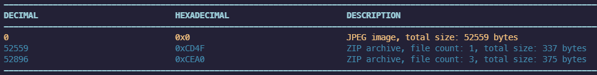

# C-1: Basic Hide And Seek
> A rogue dev hides leaked data in public images like nothing.jpg, see if you can find something useful.

[nothing.jpg](nothing.jpg)

We are given an JPEG image. The mention in the description of hiding data in images is referring to the practice of steganography. Several tools exist to examine images for embedded data, including  [binwalk](https://github.com/ReFirmLabs/binwalk). This can be used to detect embedded files within a parent file. 
Running `binwalk -e nothing.jpg` where `-e` automatically extracts any files found gives:

Extracting either of these archives has a hidden folder containing another archive, which has a file `secretctf.txt`. This contains the flag `Flag[FAFEDCABCCDEFDRF]`.
