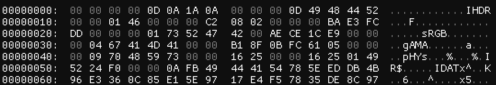
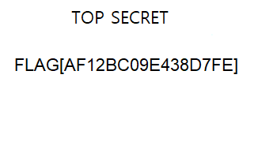

# C-13: Headerless Truth
> What appears broken may just be missing a small piece. Find what’s absent, and the hidden truth will come into focus. [Secret.png](Secret.png)

The PNG is corrupted, and running `pngcheck` outputs:
```
pngcheck Secret.png
Secret.png  this is neither a PNG or JNG image nor a MNG stream
ERROR: Secret.png
```
Investigating further, we open the file in a hex editor:


We are missing the first four bytes of the [PNG file structure](https://en.wikipedia.org/wiki/PNG#File_format). Adding `0x89504E47` fixes the issue and allows us to view the image:


