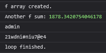
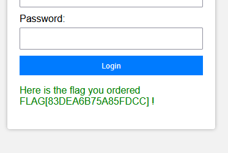

# C-15: Secure Login
> You have ordered a flag, but you have to login to claim it [here](https://web.archive.org/web/20250714102018/https://ctf.nzcsc.org.nz/challenge15/securelogin.php)

*Unfortunately due to the nature of this challenge we are unable to archive it.*

We are greeted by a simple login page. Checking the site's source, we see a lot of JS in a script tag, including many `console.log` calls. We could read through each line, or just check the console:

The username and password are printed among many random `f`s.
Logging in with these credentials gives us the flag:
