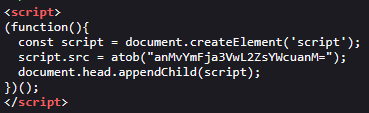
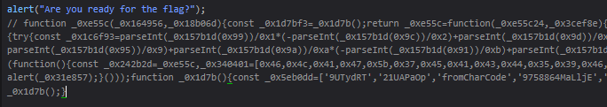

# C-2: Fun Facts
>You found a simple webpage full of fun facts. But something feels off, check it out! [View The Site Here](https://web.archive.org/web/20250713090934/https://ctf.nzcsc.org.nz/challenge2/home.html)

When we enter this site a popup appears saying 'Are you ready for the flag?', however dismissing it does nothing.
The site itself contains no relevant information; a header tells us to look deeper. Inspecting the code of the main page contains several HTML comments, one with JavaScript code, one with an unfortunate typo in two file paths, and one with base64.
The first comment decodes a base64 string, then URL escapes and un-escapes invalid characters; however the base64 is invalid. Neither of the files in the second comment are valid URLs, and the third comment's encoded string decodes to `{fake_flag_ha!}`.

There is also a script tag at the bottom that creates another script element in the page's head, and sets the source to a decoded base64 string with the value of `js/backup/flag.js`. Navigating to this URL, or opening it in the Debugger/Sources tab of our browser's developer tools shows the code responsible for the initial popup, followed by a large section of commented-out, obfuscated code. 

Running this code (using the Console tab) produces a new popup containing the flag: `FLAG[7EACD59F234B8D6F]`