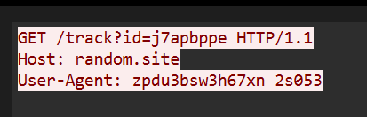
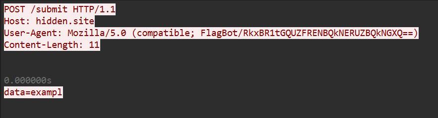

# C-3: Mysterious Browser Identity
> Long ago, a rare browser visited the server, leaving behind a secret trace in its unique signature. Can you identify which browser made that visit and uncover the hidden message it carried? Look closely at the past requests — the truth lies in the details. [trace.pcap](trace.pcap)

This packet capture contains a variety of different network protocols - TCP, UDP, HTTP, TFTP, - even Skype. We can narrow this down a lot by checking the description again: browsers are obviously web clients, so we should start by looking at the HTTP data. 

Filtering to just this protocol (by typing `http` in the filter bar at the top) shows ~50 requests to either `/track`, `/form`, and one request to `/submit`. 

Browsers typically transmit information about themselves in the `User-Agent` header, which usually is somewhat sensible (`Mozilla/5.0 (Windows NT 10.0; Win64; x64; rv:140.0) Gecko/20100101 Firefox/140.0`, for example, is Firefox v140 on a x64 machine running Win 10.) 

Looking at the first HTTP request, starting at packet number 6:

> This view is accessible via right-clicking on the packet in the main view, then Follow -> HTTP Stream, and is very useful for larger transactions.

This is not exactly a flag. We can click through the different requests until we eventually get to the one request to `/submit`:

The user agent here contains base 64 encoded data, which can be decoded to give the flag: `FLAG[FAFEDCABCDEFABCF]`