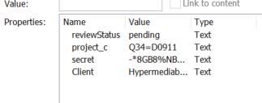

# C-5: The Insider's Footprint
> This seemingly normal company report was intercepted during a suspected insider exfiltration. It looks like a generic template, but analysts believe sensitive information was hidden inside — possibly in document properties, comments, or other embedded data. Your task: find and extract the secret message.

[[secret_report.docx]]

Opening the document in Microsoft Word we can see there is a strong indication for the reader to check the embedded data and document properties. After a quick search we can access a document's properties by going to File -> Info. A brief summary of properties are visible on the right hand side, but more advanced properties are accessible by clicking on Properties -> Advanced Properties.
Clicking through the tabs we can see a suspicious entry in Custom:

The `secret` property has a value of `-*8GB8%NBCL6W59:Q6G:63R6L%67:6656`.
This sequence appears to be encoded in some way, and after some research (or perhaps a [faster way](https://www.dcode.fr/cipher-identifier)) we come upon Base45. The unique use of symbols is also a key point for the use of this encoding. Decoding gives us `FLAG[433H2447B4869790]`.