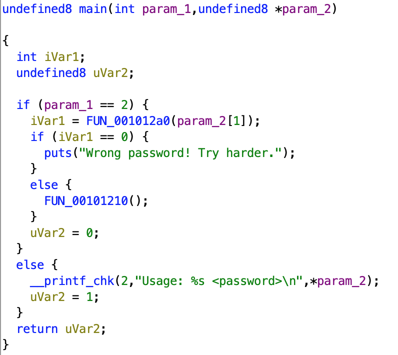
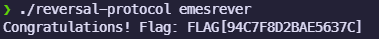

# C-6: Reversal Protocol
>A small executable is discovered deep within the filesystem. It accepts a single argument and responds with nothing more than a dismissive message — unless the correct input is provided. Your mission is to investigate the binary, understand the logic behind the input validation, and extract the hidden flag buried within. [[reversal_protocol|Download the Executable Here]]

Using everyone's favourite disassembler Ghidra we can inspect the code.
The main function (auto labelled as `FUN_001010c0`) contains this disassembled code: 

As `param_2`has an array-like type, and `param_1`is seemingly checked for the size of this array, we can predict that this corresponds to the standard `argc` and `argv` parameters in a C `main`function.
The first element in the `argv`array is the name of the executable (`reversal_protocol`), and from the error message printed in the `else` statement we can see that the second element is expected to be a password. This password is checked via `FUN_001012a0` (henceforth `check_password`.) It will return a boolean value - true/1 if the password is correct, false/0 if the password is incorrect.
We can inspect `check_password` to see how the correct password is generated.
[[]]
It is easiest to understand this function by reading it in reverse. We can see that there is a return statement inside an if statement.
> This check is something called a stack canary. It is used to prevent unintended modification of variables. It can be bypassed, but that's not part of this challenge. All you need to know for this step is that if you use the program as intended this will always be true.

Our function returns true if `iVar1` is equal to 0.
> Ghidra names the variables sequentially with letter/s at the beginning denoting their type. `i`is an int, `l`is a long, `b` is a boolean, `pc` is a char pointer, etc.

This is set just above to the result of `strcmp` (**str**ing **c**o**mp**are) with our input parameter and a character buffer of length 9. Somewhat confusingly, `strcmp` returns 0 when the two strings are equal. This means that our input must be equal to the value `local_28`.
Jumping back to the top:
```c
lVar2 = 0;
do {
	local_48[lVar2] = s_reverseme_00104028[lVar2];
	lVar2 = lVar2 + 1;
} while (lVar2 != 9);
```
This is effectively a for loop, using `lVar2` as the iterator. It copies the first 9 characters from the string `s_reverseme` to `local_48`. Double clicking on the former shows the value of the string literal to be `reverseme`. Ghidra has helpfully named the variable with the contents of the literal.
```c
pcVar3 = local_48 + 8;
pcVar4 = local_28;
```
As both of these `local_**` variables are char arrays, the value stored is a pointer to the first element in the array. This means `pcVar3` points to the ninth character in the array initialised above, and `pcVar4` points to the first in the currently empty array we compare to at the end.
```c
do {
	*pcVar4 = *pcVar3;
	bVar5 = pcVar3 != local_48;
	pcVar3 = pcVar3 + -1;
	pcVar4 = pcVar4 + 1;
} while (bVar5);
```
Let's break this down line by line.
The first line sets the value pointed to by `pcVar4` to the value pointed to by `pcVar3`.
The second line sets a boolean variable to true if `pcVar3` reaches the start of `local_48`, the char array we copied the string literal to.
The third line decrements `pcVar3` by one byte, and the fourth line increments `pcVar4` by one byte.
So this will run for each character in `local_48`, copying the last character of the original array to the first character in the array compared against the user input. As the pointers change, we effectively reverse `local_48` and store it in `local_28`.
Finally, the loop stops once the pointer in `local_48` reaches the start, and we perform the check outlined above. This means the password is the string literal provided, but reversed:
`emesrever`
Now that we understand the program flow, we can run it. Without a password, it prints `Usage: ./reversal_protocol <password>` as predicted. With the discerned password:


Of course, you could skip all of that by guessing that `reverseme` had to be reversed, but where would be the fun in that?