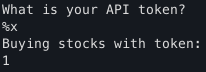
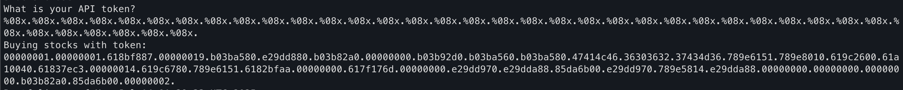
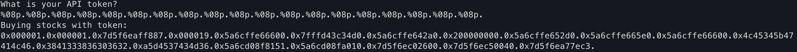

# C-9: Super AI Trader
> Uncover a hidden gem in the Stonks Trading App by cleverly manipulating user input to reveal a secret on the stack.  
  Connect over TCP using netcat or a similar program to solve: `nc ctf.nzcsc.org.nz 61870`
  [[pwn.c | View Source Code Here]]
  
*Unfortunately due to the nature of this challenge we are unable to archive it.*

Connecting to the app gives us:
```
Welcome back to the trading app!

What would you like to do?
1) Buy some stocks!
2) View my portfolio
```
Entering 1 prints:
```
Using patented AI algorithms to buy stocks
Stocks chosen
What is your API token?
api token
Buying stocks with token:
api
Portfolio as of Mon Jul 14 01:16:44 UTC 2025


78 shares of J
57 shares of FNHD
Goodbye!
```
where the user enters their 'API token' after `What is your API token?`, and it is printed out after `Buying stocks with token:`. Interestingly, only the first word is printed. Investigating this section of the code, we can see that the flag is stored in a variable on the stack. Some logic is used to 'choose stocks with AI', before we are asked for the API token. The use of `scanf` here is safe, as only the first 300 characters of our input are read, and stored in a correctly sized buffer. However, the use of `printf` when reading back the API token is unsafe, and is potentially vulnerable to [format string injection](https://en.wikipedia.org/wiki/Uncontrolled_format_string). We can test this by entering `%x` as our API token. This is usually used to retrieve an integer parameter to `printf` and read it as hex, but as there are no parameters in this case it will read further down the stack.

We can further exploit this by chaining several of these:

> Format string 101:
> The `%` is used to access a variable from the parameters or in our case, the stack. The `h` formats the next 4-byte value as hex. The `08` is used to pad the values to 8 digits using zeroes. The full stop is used as this program does not allow any data to be sent after a space.

Cleaning up the data, and decoding from hex gives us:
```
........a.ø.....°;¥.â.Ø.°;. ....°;.а;¥`°;¥.GALF60627CM6x.aQx...a.&.a¡.@a.~Ã....a.g.x.aQa.¿ª....a..m....â.Ùpâ.Ú..Úk.â.Ùpx.X.â.Ú.............°;. .Úk.....
```
There is a section that looks interesting, starting with `GALF` or FLAG backwards. This is due to the endianness of the program, or how multi-byte values are stored. We can fix this (and trim out some unneeded data) to give `FLAG26066MC7Qa.x...x`. Among other things, we're missing the square brackets. The values of these are `0x5B` and `Ox5D`. The current hex value is `47414c46.36303632.37434d36.789e6151.789e8010`, which doesn't seem to contain any bytes that match. We can modify our format string to contain a larger value, by using the format string for an address, `%08p`.

Much more data! Decoding this gives `FLAG[4EL260683A8..Ó4tSÔ¥` which is almost right. Taking one last look at the hex `0x4c45345b47414c46.0x3841333836303632.0xa5d4537434d36` we can see the closing bracket `0x5d` but it has some data in front of it. We can now piece the flag together byte by byte, starting at the end of the first byte, then working backwards through it. This gives the hex `46 4c 41 47 5b 34 45 4c 32 36 30 36 38 33 41 38 36 4d 43 37 45 5d` which when decoded gives `FLAG[4EL260683A86MC7E]`.